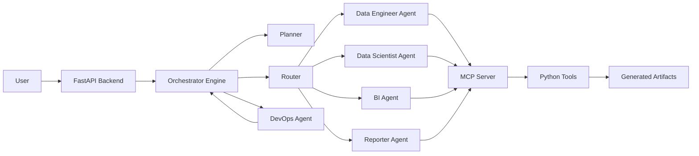
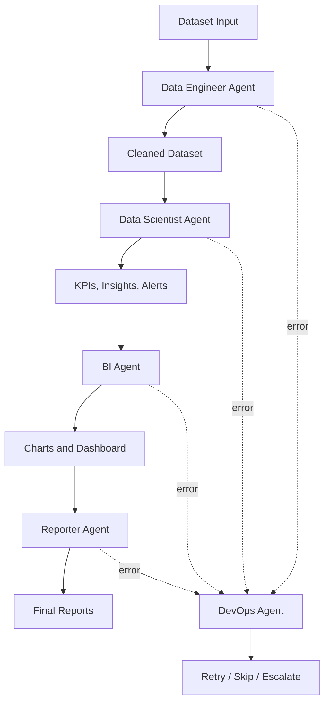

# An Agentic MCP-Powered AI Ecosystem for Data Analytics

## Overview

This project is an intelligent multi-agent data analytics ecosystem designed to automate the complete workflow of data analysis.

It starts from a raw dataset and produces:

- cleaned data,
- data profiling,
- KPI analysis,
- business insights,
- anomaly alerts,
- interactive dashboards,
- HTML, PDF, and Excel reports,
- execution traces for audit and debugging.

The system is built with a modular multi-agent architecture where each agent has a specific responsibility. The agents use an MCP server to call tools safely and traceably.

---

## Project Report

A complete academic report is available in this repository.

[Download the full project report](./rapport_grp3%20(1).pdf)

The report explains the project context, architecture, agents, MCP concept, implementation details, generated artifacts, and results.

---

## Academic Context

| Information | Details |
|---|---|
| Project type | Projet de Fin d'Annee |
| Academic year | 2025-2026 |
| Field | DATA SCIENCE AND CLOUD COMPUTING|
| Option | Artificial Intelligence and Analytics |
| Project title | An Agentic MCP-Powered AI Ecosystem for Data Analytics |


---

## Main Objective

The objective of this project is to build an AI-powered analytics platform capable of transforming raw data into useful business decisions.

Instead of manually cleaning data, calculating KPIs, creating dashboards, and writing reports, the platform automates the full process using specialized agents.

The system can be used for:

- business intelligence,
- KPI monitoring,
- automated reporting,
- data quality monitoring,
- anomaly detection,
- AI-assisted data analysis,
- academic data science demonstrations.

---

## Key Features

- Multi-agent architecture
- MCP-based tool calling
- FastAPI backend
- Dataset upload and processing
- Data cleaning and profiling
- KPI calculation
- Business insight generation
- Anonymous dataset handling
- Groq LLM integration
- Automatic chart generation
- Interactive dashboard generation
- Automated HTML, PDF, and Excel reports
- DevOps supervision with retry, skip, and escalation
- Traceability through metadata, tool calls, and decision logs

---

## Technologies Used

| Technology | Role |
|---|---|
| Python | Main programming language |
| FastAPI | Backend API |
| Uvicorn | ASGI server |
| Pandas | Data processing and KPI calculation |
| Plotly | Interactive chart generation |
| Groq LLM | AI reasoning and decision support |
| MCP | Secure tool calling between agents and tools |
| HTML / CSS / JavaScript | User interface and dashboards |
| JSON / JSONL | Artifact storage and execution traces |

---

## Global Architecture



---

## How the System Works

The project works like an intelligent analytics team.

Each agent has a specific role:

1. The user uploads a dataset or provides a data source.
2. FastAPI receives the request.
3. The Orchestrator Engine starts a new execution run.
4. The Planner decides the next pipeline step.
5. The Router selects the correct agent.
6. The selected agent asks the MCP Server to execute tools.
7. Python tools process the data and generate artifacts.
8. The DevOps Agent supervises errors and decisions.
9. The final dashboard and reports are generated.

---

## Pipeline Flow



---

## Agents

### Data Engineer Agent

The Data Engineer Agent prepares the dataset before analysis.

It is responsible for:

- loading datasets,
- validating columns,
- checking data quality,
- detecting missing values,
- detecting duplicates,
- correcting data types,
- cleaning data,
- generating cleaning rules,
- producing a clean dataset for the next agent.

Main outputs:

```text
cleaned_data.csv
profile.json
cleaning_rules.json
```

---

### Data Scientist Agent

The Data Scientist Agent analyzes the cleaned dataset and extracts useful information.

It is responsible for:

- detecting the data domain,
- calculating KPIs,
- generating insights,
- detecting anomalies,
- generating alerts,
- creating chart hints for the BI Agent,
- handling anonymous or unclear column names.

Main output:

```text
insights.json
```

The Data Scientist Agent can use Groq LLM to reason about the dataset and suggest relevant KPIs. The real calculations are performed using Python and Pandas.

---

### BI Agent

The BI Agent transforms analytical results into visual dashboards.

It is responsible for:

- reading KPIs and insights,
- generating charts,
- preparing dashboard data,
- creating dashboard payloads,
- publishing the final dashboard,
- creating a handoff file for the Reporter Agent.

Main outputs:

```text
dashboard.html
dashboard_payload.json
dashboard_artifacts_manifest.json
bi_agent_handoff.json
charts/
```

---

### Reporter Agent

The Reporter Agent generates final documents from all previous results.

It is responsible for:

- reading generated artifacts,
- collecting KPIs and charts,
- summarizing the pipeline execution,
- creating a readable final report,
- exporting results into multiple formats.

Main outputs:

```text
report.html
report.pdf
report.xlsx
```

---

### DevOps Agent

The DevOps Agent supervises the pipeline.

It is responsible for:

- detecting failed steps,
- deciding whether to retry, skip, or escalate,
- saving decisions,
- improving traceability,
- helping maintain a robust execution flow.

Possible actions:

| Action | Meaning |
|---|---|
| retry | Try the failed step again |
| skip | Continue the pipeline without the failed non-critical step |
| escalate | Stop the pipeline and report a critical issue |

Main output:

```text
decisions.jsonl
```

---

## MCP Server

MCP means Model Context Protocol.

In this project, the MCP Server acts as a controlled bridge between agents and tools.

Agents do not execute tools directly. They send a tool request to the MCP Server. The MCP Server validates the request, checks permissions, executes the correct Python tool, and logs the execution.

```text
Agent
  -> MCP Server
  -> Tool
  -> Result
  -> Agent
```

This improves:

- security,
- modularity,
- traceability,
- tool governance,
- separation between reasoning and execution.

---

## Tool Calling

Tool calling means that an AI agent can request the execution of a real function.

Example:

```text
Data Scientist Agent asks:
"Run the data analysis tool"

MCP executes:
run_analysis.py

The result is returned:
KPIs, insights, alerts, chart hints
```

The LLM helps decide what should be done, but Python tools perform the real execution.

---

## Groq LLM Usage

Groq is used as the LLM provider.

It helps with:

- understanding the dataset,
- suggesting relevant KPIs,
- generating insights,
- supporting anonymous column naming,
- helping with unknown DevOps decisions.

The API key must be configured in the `.env` file:

```env
GROQ_API_KEY=your_groq_api_key_here
```

The repository contains only `.env.example`. The real `.env` file must not be pushed to GitHub.

---

## Anonymous Dataset Handling

The system supports datasets with unclear or anonymous column names.

Examples:

```text
x1, x2, x3
col_1, col_2
a, b, c
feature_1, feature_2
```

The system detects anonymous datasets when many column names are generic or unknown.

Then it applies two strategies:

1. Groq suggests provisional column names using column statistics.
2. If Groq is unavailable, a local fallback generates names using data patterns.

Example:

| Original Column | Provisional Meaning |
|---|---|
| x1 | customer_id |
| x2 | amount_total |
| x3 | satisfaction_score |
| x4 | category_type |

This allows the analytics pipeline to continue even when the dataset is not well documented.

---

## Chart Hints

Chart hints are suggestions generated by the Data Scientist Agent to help the BI Agent choose the right visualization.

Example:

```json
{
  "chart_id": "department_distribution",
  "type": "pie_chart",
  "title": "Department Distribution"
}
```

If Groq does not generate chart hints, the system uses a fallback based on KPI names.

| KPI Name Contains | Chart Type |
|---|---|
| distribution, type, status | Pie chart |
| trend, rate, score | Line chart |
| total, count, revenue, salary | Bar chart |

---

## DevOps Error Handling

When a step fails, the Orchestrator Engine sends the error to the DevOps Agent.

The DevOps Agent decides the next action using deterministic rules and sometimes LLM support.

| Error Type | DevOps Action |
|---|---|
| timeout | retry |
| connection refused | retry |
| rate limit | retry |
| API key missing | escalate |
| authentication error | escalate |
| permission denied | escalate |
| repeated non-critical error | skip |

The maximum number of retries is configured with:

```env
DEVOPS_MAX_RETRIES=2
```

---

## Generated Artifacts

Each execution creates a folder inside `runs/`.

Example:

```text
runs/
  run_001/
    metadata.json
    tool_calls.jsonl
    decisions.jsonl
    artifacts/
      cleaned_data.csv
      profile.json
      cleaning_rules.json
      insights.json
      dashboard.html
      dashboard_payload.json
      dashboard_artifacts_manifest.json
      bi_agent_handoff.json
      report.html
      report.pdf
      report.xlsx
      charts/
```

---

## Important Generated Files

| File | Description |
|---|---|
| metadata.json | Global information about the run |
| tool_calls.jsonl | History of MCP tool calls |
| decisions.jsonl | DevOps decisions |
| cleaned_data.csv | Cleaned dataset |
| profile.json | Dataset profile |
| cleaning_rules.json | Applied cleaning rules |
| insights.json | KPIs, insights, anomalies, alerts |
| dashboard_payload.json | Data used by the dashboard |
| dashboard.html | Interactive dashboard |
| bi_agent_handoff.json | BI summary passed to reporting |
| report.pdf | Final PDF report |
| report.xlsx | Final Excel report |

---

## Project Structure

```text
app/
  agents/
    base_agent.py
    data_engineer.py
    data_scientist.py
    bi_agent.py
    reporter.py
    devops_agent.py

  mcp/
    server.py
    registry.py
    schemas.py
    auth.py

  orchestrator/
    engine.py
    planner.py
    router.py
    models.py
    state.py

  tools/
    load_dataset.py
    clean_data.py
    profile_data.py
    run_analysis.py
    generate_chart.py
    publish_dashboard.py
    compile_report.py
    log_artifact.py

  storage/
    artifact_store.py
    run_store.py

  ui/
    index.html

  main.py
  config.py
```

---

## Installation

### 1. Clone the repository

```bash
git clone https://github.com/Safae-az/An-Agentic-MCP-Powered-AI-Ecosystem-for-Data-Analytics-.git
cd An-Agentic-MCP-Powered-AI-Ecosystem-for-Data-Analytics-
```

### 2. Create a virtual environment

```bash
python -m venv .venv
```

### 3. Activate the virtual environment

On Windows:

```bash
.venv\Scripts\activate
```

On Linux or macOS:

```bash
source .venv/bin/activate
```

### 4. Install dependencies

```bash
pip install -r requirements.txt
```

### 5. Create the environment file

On Windows:

```bash
copy .env.example .env
```

On Linux or macOS:

```bash
cp .env.example .env
```

Then edit `.env` and add your Groq API key:

```env
GROQ_API_KEY=your_groq_api_key_here
```

---

## Running the Project

The project requires two servers.

### Terminal 1: Start the MCP Server

```bash
uvicorn app.mcp.server:app --port 8000 --reload
```

### Terminal 2: Start the Main FastAPI App

```bash
uvicorn app.main:app --port 8001 --reload
```

Then open:

```text
http://localhost:8001
```

---

## Useful API Endpoints

| Endpoint | Description |
|---|---|
| `/` | Main web interface |
| `/api` | API information |
| `/health` | Health check |
| `/run/start` | Start pipeline run |
| `/run/start-upload` | Start run from uploaded file |
| `/run/start-url` | Start run from URL |
| `/run/start-api` | Start run from API |
| `/runs` | List generated runs |
| `/datasets` | List available datasets |

---

## Example Workflow

```text
Upload dataset
  -> FastAPI receives request
  -> Engine creates run
  -> Data Engineer cleans data
  -> Data Scientist calculates KPIs
  -> BI Agent creates charts and dashboard
  -> Reporter generates report
  -> DevOps stores trace and handles errors
```

---

## Dashboard Output

The generated dashboard includes:

- KPI cards,
- interactive charts,
- alerts,
- business insights,
- generated artifact links,
- execution summary.

Dashboard location:

```text
runs/<run_id>/artifacts/dashboard.html
```

---

## Report Output

The system can generate:

```text
report.html
report.pdf
report.xlsx
```

These reports include:

- dataset summary,
- data quality results,
- cleaning operations,
- KPIs,
- alerts,
- anomalies,
- charts,
- dashboard information,
- execution trace.

---

## Why This Project Matters

This project reduces the manual effort required in data analytics.

Instead of manually cleaning data, calculating KPIs, creating dashboards, and writing reports, the system automates the full workflow using intelligent agents.

It demonstrates how LLMs, MCP, FastAPI, and data analytics tools can be combined to build a practical AI-powered analytics ecosystem.

---

## Strengths of the Project

- Clear multi-agent architecture
- Separation of responsibilities
- Secure MCP tool calling
- Automated data cleaning
- Automated KPI generation
- Anonymous data support
- Dashboard generation
- Report generation
- DevOps supervision
- Traceable execution logs
- Extensible project structure

---

## Future Improvements

- Add user authentication
- Add Docker deployment
- Add database connectors
- Add real-time dashboard updates
- Improve anomaly detection
- Add more visualization types
- Add role-based access control
- Improve UI design
- Add cloud deployment support

---

## Authors

**Project:** An Agentic MCP-Powered AI Ecosystem for Data Analytics  
**Academic Year:** 2025-2026  
**Field:** DATA SCIENCE AND CLOUD COMPUTING 
---

## License

This project is intended for academic and educational purposes.
